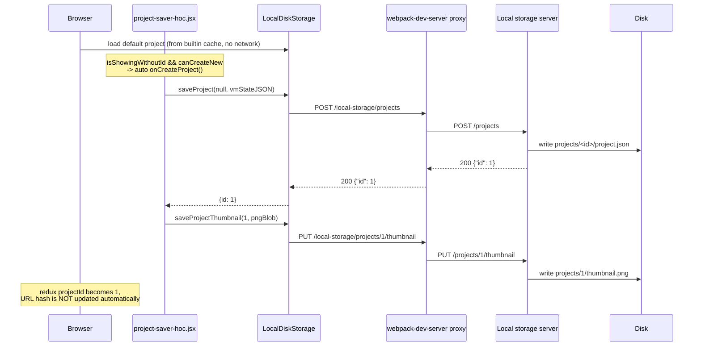
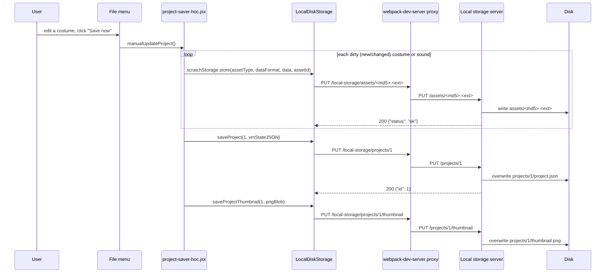
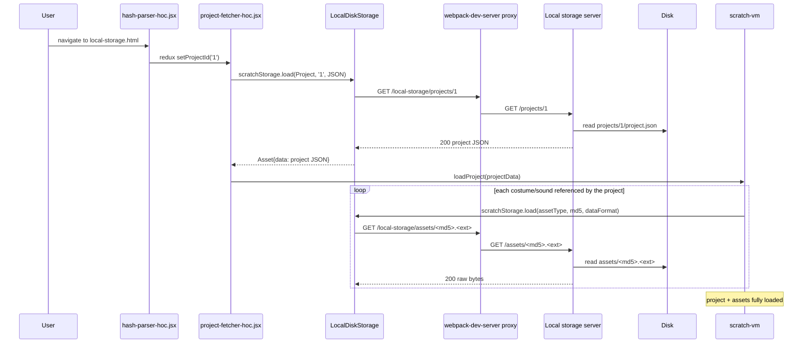

# Local disk storage server

This is a reference implementation of the server side of scratch-gui's
`GUIStorage` plug-in seam (`../src/gui-config.ts`). It writes projects,
costume/sound assets, and thumbnails to the local filesystem under
`./.data`, instead of talking to MIT's real project/asset servers (which is
what the default `legacy-storage.ts`/`legacy-config.ts` does).

It exists purely to make the `GUIStorage`/`@scratch/scratch-storage` contract
concrete and inspectable — not for production use. It has no auth, no
validation beyond basic shape-checking, and stores everything as plain files.

## Running it

Two processes, in two terminals, from `packages/scratch-gui`:

```bash
npm run start:local-storage-server   # Express server on :8701
npm start                            # webpack-dev-server (the editor itself)
```

Then open `http://localhost:<dev-server-port>/local-storage.html` (the port
webpack-dev-server prints on startup — 8601 by default, or whatever `PORT` is
set to). webpack-dev-server reverse-proxies any request under `/local-storage`
to `http://localhost:8701` (see the `devServer.proxy` entry in
`../webpack.config.js`), so the browser only ever talks to its own origin —
no CORS handling is needed on this server.

The default `index.html` demo (`legacy-storage.ts`/`legacy-config.ts`) is
untouched by any of this.

## How the client finds this server

`../src/lib/local-disk-storage.ts` implements `GUIStorage` and registers
these routes with `@scratch/scratch-storage` via `ScratchStorage.addWebStore`,
using relative URLs like `/local-storage/projects/1` — the same relative-URL
approach `legacy-storage.ts` uses for MIT's hosts, just pointed at this
server instead.

## Route reference

### `POST /projects`

- **Triggered by:** `GUIStorage.saveProject(projectId, vmState, params)` when
  `projectId` is `null`/`undefined` — i.e. creating a project that doesn't
  exist on the server yet.
- **Request:** body = raw project JSON text (the VM's serialized state, from
  `vm.toJSON()`), `Content-Type: application/json`. No path params.
- **Response:** `200 {"id": <number>}` — a freshly minted, auto-incrementing
  numeric id. Numeric on purpose: the editor's URL-hash project loader
  (`hash-parser-hoc.jsx`) only recognizes `#<digits>`, so a non-numeric id
  (e.g. a UUID) could never be reloaded via the URL.
- **On disk:** creates `./.data/projects/<id>/project.json`.
- **Failure modes:** none expected in normal use; a write failure surfaces as
  a rejected promise, which `project-saver-hoc.jsx` turns into a
  `creatingError` alert.

### `PUT /projects/:id`

- **Triggered by:** `GUIStorage.saveProject(projectId, vmState, params)` when
  `projectId` is already known — i.e. updating an existing project ("Save
  now" on a project that's already been created).
- **Request:** body = raw project JSON text, same shape as the `POST` above.
  `:id` must match `^\d+$`.
- **Response:** `200 {"id": <number>}` (echoes the id back, matching the
  `Promise<{id}>` shape `saveProject` must resolve).
- **On disk:** overwrites `./.data/projects/<id>/project.json`.
- **Failure modes:** `400` if `:id` isn't numeric. There's no `404` for an
  unknown id — this server creates the project directory on the fly rather
  than requiring `POST` first, to keep things simple.

### `GET /projects/:id`

- **Triggered by:** `scratchStorage.load(AssetType.Project, projectId,
  DataFormat.JSON)`, called from `project-fetcher-hoc.jsx` whenever the
  redux `projectId` changes (in this demo, that's driven by `#<id>` in the
  URL via `hash-parser-hoc.jsx`).
- **Request:** no body. `:id` must match `^\d+$`.
- **Response:** `200`, body = the raw project JSON exactly as it was stored,
  `Content-Type: application/json`. `404` if no such project exists, `400`
  if `:id` isn't numeric.
- **Failure modes worth knowing:** a `404`/rejection here is **not** treated
  as "start a blank project" — `project-fetcher-hoc.jsx` throws `'Could not
  find project'`, which surfaces as an error alert in the GUI. Navigating to
  an id that was never saved will show an error, not a blank canvas.

### `PUT /projects/:id/thumbnail`

- **Triggered by:** `GUIStorage.saveProjectThumbnail(projectId, thumbnail,
  onSuccess?, onError?)`. Because `LocalDiskStorage` implements this method,
  `project-saver-hoc.jsx` automatically calls it after **every** successful
  project save (not just ones you trigger manually) — see "Behavior notes"
  below.
- **Request:** body = raw PNG bytes (the `Blob` the GUI generates from the
  stage). `:id` must match `^\d+$`.
- **Response:** `200`, empty body.
- **On disk:** writes `./.data/projects/<id>/thumbnail.png`.
- **Note:** this route is write-only. Nothing in scratch-gui ever fetches a
  thumbnail back through `GUIStorage` — thumbnails are a one-way "upload for
  some other consumer" concept (on scratch.mit.edu, the project page display).
  There's no corresponding `GET` route.

### `PUT /assets/:filename`

- **Triggered by:** `scratchStorage.store(assetType, dataFormat, data,
  assetId)`, called from `project-saver-hoc.jsx`'s `storeProject()` once per
  *dirty* (new or changed) costume/sound before the project JSON itself is
  saved.
- **Request:** body = raw binary asset bytes. `:filename` is
  `<md5-hash>.<extension>` (e.g. `83c36d806dc92327b9e7049a565c6bff.wav`) —
  assets are content-addressed, so the same bytes always produce the same
  filename, making `create` and `update` the same idempotent operation.
- **Response:** `200 {"status": "ok"}` — **this exact shape is load-bearing**.
  `project-saver-hoc.jsx` hardcodes `if (response.status !== 'ok')
  return Promise.reject(response.code)`, a contract inherited from MIT's
  real asset server API. Any other response shape here would make every
  save with a changed costume/sound fail, even though the file was written
  successfully.
- **On disk:** writes `./.data/assets/<filename>`.
- **Failure modes:** `400` if `:filename` doesn't look like `<hex>.<ext>`.

### `GET /assets/:filename`

- **Triggered by:** `scratchStorage.load(assetType, assetId, dataFormat)`,
  called once per costume/sound as the VM resolves a loaded project's
  references.
- **Request:** no body. `:filename` validated the same way as the `PUT`.
- **Response:** `200`, body = raw bytes, `Content-Type` inferred from the
  extension (`svg`→`image/svg+xml`, `png`→`image/png`, `wav`→`audio/x-wav`,
  etc. — falls back to `application/octet-stream`). `404` if missing.
- **Failure modes:** a missing asset rejects the corresponding
  `scratch-storage` load; how visibly that surfaces depends on what's
  referencing it (a missing costume can render as a blank/broken sprite).

## Behavior notes (things that are easy to miss)

- **The very first project save happens automatically, with no button
  click.** The demo passes `canCreateNew` to `<GUI>`. Per
  `project-saver-hoc.jsx`, whenever the app is showing a project with no id
  yet (the freshly-loaded default project) *and* `canCreateNew` is true, it
  automatically dispatches a project creation — no "New" click required.
  Concretely: load `local-storage.html` with no `#` hash, and within a
  moment you'll see `./.data/projects/1/project.json` (or the next free id)
  appear on disk, with no visible click.
- **Every project save also saves a thumbnail**, not just the first one —
  because `LocalDiskStorage` implements `saveProjectThumbnail`,
  `project-saver-hoc.jsx` calls it after any successful `saveProject`.
- **Saving a project does not update the browser's URL hash.**
  `hash-parser-hoc.jsx` only reads `#<id>` into redux; nothing writes redux's
  project id back out to the URL. To reload a saved project later, check
  `./.data/projects/` (or the network tab) for its id and navigate to
  `local-storage.html#<id>` yourself.
- **The File menu's "New" item is unrelated to any of this and isn't wired
  up.** It calls a top-level `onClickNew` prop that this demo doesn't
  supply — clicking it will throw. This is a pre-existing gap in
  scratch-gui's own playground scaffolding (the default `index.html` demo
  has the exact same gap), not something introduced or fixed here.

## Sequence diagrams

### 1. First load: automatic project creation



### 2. Editing and saving ("Save now")



### 3. Reloading a saved project (`#<id>` in the URL)


